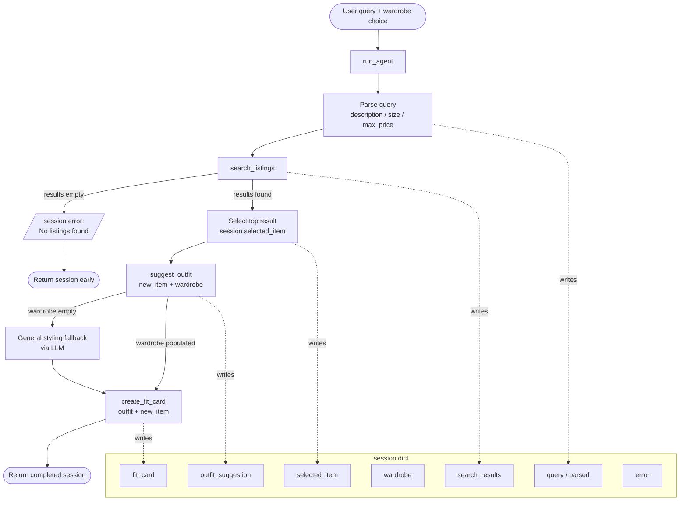

# FitFindr — planning.md

> Complete this document before writing any implementation code.
> Your spec and agent diagram are what you'll use to direct AI tools (Claude, Copilot, etc.) to generate your implementation — the more specific they are, the more useful the generated code will be.
> Your planning.md will be reviewed as part of your submission.
> Update it before starting any stretch features.

---

## Tools

List every tool your agent will use. For each tool, fill in all four fields.
You must have at least 3 tools. The three required tools are listed — add any additional tools below them.

### Tool 1: search_listings

**What it does:**
Searches the mock listings dataset for secondhand items matching a keyword description, optional size filter, and optional price ceiling. Returns a ranked list of matches sorted by keyword relevance.

**Input parameters:**
- `description` (str): Keywords describing what the user wants (e.g., "vintage graphic tee"). Used to score listings by keyword overlap against `title`, `description`, `style_tags`, and `category`.
- `size` (str | None): Size string to filter by (e.g., "M", "S/M"). Matching is case-insensitive. Pass `None` to skip size filtering.
- `max_price` (float | None): Maximum price, inclusive. Pass `None` to skip price filtering.

**What it returns:**
A list of listing dicts sorted by relevance score (highest first). Each dict contains:
`id`, `title`, `description`, `category`, `style_tags` (list), `size`, `condition`, `price` (float), `colors` (list), `brand`, `platform`.
Returns an empty list if nothing matches — never raises an exception.

**What happens if it fails or returns nothing:**
The agent sets `session["error"]` to a user-friendly message such as "No listings found for that search. Try removing the size filter or raising your price limit." The agent returns early and does NOT call `suggest_outfit` or `create_fit_card` with empty input.

---

### Tool 2: suggest_outfit

**What it does:**
Given a thrifted item the user is considering and their existing wardrobe, uses an LLM to suggest 1–2 specific outfit combinations that incorporate the new piece with items already owned.

**Input parameters:**
- `new_item` (dict): A listing dict — the item the user is considering buying. Uses fields: `title`, `category`, `style_tags`, `colors`, `condition`.
- `wardrobe` (dict): The user's wardrobe, structured as `{"items": [...]}`. Each wardrobe item has fields like name, category, color, and style tags. May be empty.

**What it returns:**
A non-empty string with 1–2 outfit suggestions. If the wardrobe is empty, returns general styling advice for the new item (what kinds of pieces pair well, what aesthetic it suits) instead of specific combinations.

**What happens if it fails or returns nothing:**
If `wardrobe["items"]` is empty, the agent falls back to general styling advice via LLM rather than raising an error. If the LLM call itself fails, the agent catches the exception and returns a descriptive fallback string like "Outfit suggestion unavailable — try again shortly."

---

### Tool 3: create_fit_card

**What it does:**
Uses an LLM at higher temperature to generate a casual, shareable 2–4 sentence caption for the new item and outfit — styled like a real OOTD (outfit of the day) Instagram or TikTok post.

**Input parameters:**
- `outfit` (str): The outfit suggestion string returned by `suggest_outfit()`.
- `new_item` (dict): The listing dict for the thrifted item. Uses `title`, `price`, and `platform`.

**What it returns:**
A 2–4 sentence string that sounds like a genuine social media caption: casual, specific about the vibe, and naturally mentioning the item name, price, and platform once each. Outputs something different for each unique input (via LLM temperature).

**What happens if it fails or returns nothing:**
If `outfit` is empty or whitespace-only, the function returns a descriptive error string like "Fit card unavailable: no outfit suggestion was provided." It does NOT raise an exception. The agent stores this in `session["fit_card"]` and still returns the session so the UI can display it.

---

### Additional Tools (if any)

None for Milestone 1. (Stretch: price comparison tool, retry-with-loosened-constraints.)

---

## Planning Loop

The agent uses a linear conditional planning loop — it calls tools in sequence but stops early if a step returns an unusable result.

**Logic:**

1. **Parse** the user query (with regex or LLM) to extract `description`, `size`, and `max_price`. Store in `session["parsed"]`.
2. **Search:** Call `search_listings()` with parsed params. Store results in `session["search_results"]`.
   - **Branch:** If results are empty → set `session["error"]` → return session. Done.
3. **Select:** Pick `session["search_results"][0]` (top relevance score). Store as `session["selected_item"]`.
4. **Outfit:** Call `suggest_outfit(selected_item, wardrobe)`. Store result as `session["outfit_suggestion"]`.
5. **Fit card:** Call `create_fit_card(outfit_suggestion, selected_item)`. Store as `session["fit_card"]`.
6. Return the completed session.

The loop knows it's done when it either hits the empty-results branch (early exit) or completes step 5. It does not revisit earlier steps — each step's output gates the next.

---

## State Management

All state lives in the `session` dict initialized by `_new_session()`. It is the single source of truth passed through the entire loop.

| Key | Set by | Used by |
|-----|--------|---------|
| `query` | `_new_session()` | parsing step |
| `parsed` | parsing step | `search_listings()` |
| `search_results` | `search_listings()` | item selection |
| `selected_item` | item selection | `suggest_outfit()`, `create_fit_card()` |
| `wardrobe` | `_new_session()` (from caller) | `suggest_outfit()` |
| `outfit_suggestion` | `suggest_outfit()` | `create_fit_card()` |
| `fit_card` | `create_fit_card()` | returned to UI |
| `error` | any step on failure | caller checks this first |

No tool modifies the session directly — `run_agent()` stores each tool's return value into the session and passes the relevant pieces to the next tool. This makes each tool testable in isolation.

---

## Error Handling

| Tool | Failure mode | Agent response |
|------|-------------|----------------|
| `search_listings` | No results match the query | Set `session["error"]` to a friendly message ("No listings found — try relaxing your filters"). Return session immediately without calling later tools. |
| `suggest_outfit` | Wardrobe is empty | Call LLM with a general styling prompt instead of a wardrobe-specific one. Always return a non-empty string. |
| `create_fit_card` | `outfit` is empty or whitespace | Return a descriptive error string immediately, without calling the LLM. The agent stores it in `session["fit_card"]` and continues returning the session normally. |

---

## Architecture

---

## AI Tool Plan

**Milestone 3 — Individual tool implementations:**

- **`search_listings`:** Give Claude the Tool 1 spec (inputs, return value, failure mode) plus the listing field list (`id`, `title`, `description`, `category`, `style_tags`, `size`, `condition`, `price`, `colors`, `brand`, `platform`). Tell it to use `load_listings()` from `data_loader.py`, filter by `max_price` and `size`, score by keyword overlap across `title`, `description`, and `style_tags`, drop zero-score items, and return sorted results. Verify by running 3 manual queries: one that should find results, one with a strict size filter, and the deliberate no-results query (`"designer ballgown size XXS under $5"`).

- **`suggest_outfit`:** Give Claude the Tool 2 spec plus the wardrobe schema structure. Instruct it to format the wardrobe `items` list into a readable prompt and make two separate LLM calls — one for the populated-wardrobe case and one for the empty-wardrobe fallback. Verify by calling the tool with `get_example_wardrobe()` and `get_empty_wardrobe()` and checking that both return non-empty strings.

- **`create_fit_card`:** Give Claude the Tool 3 spec and the style guidelines (casual, authentic, mention item name/price/platform once each, higher temperature). Verify by calling it twice with the same inputs and confirming the outputs sound different and read like real social media captions — not product descriptions.

**Milestone 4 — Planning loop and state management:**

Give Claude the Architecture diagram and the State Management table from this file, plus the `_new_session()` stub from `agent.py`. Instruct it to implement `run_agent()` step by step matching the planning loop description above — especially the early-exit branch when `search_results` is empty. Verify using the two CLI tests already in `agent.py`: the happy path (`"looking for a vintage graphic tee under $30"`) and the no-results path (`"designer ballgown size XXS under $5"`).

---

## A Complete Interaction (Step by Step)

FitFindr helps users find secondhand clothing that matches a description and budget, then shows them how to wear it with what they already own, and generates a shareable caption. Each tool is triggered by the output of the previous one; if the search returns nothing, the agent stops and tells the user what to adjust rather than proceeding with empty data.

**Example user query:** "I'm looking for a vintage graphic tee under $30. I mostly wear baggy jeans and chunky sneakers. What's out there and how would I style it?"

**Step 1: Parse the query**
`run_agent()` extracts: `description = "vintage graphic tee"`, `size = None` (not mentioned), `max_price = 30.0`. Stores in `session["parsed"]`.

**Step 2: Search listings**
Calls `search_listings("vintage graphic tee", size=None, max_price=30.0)`.
Tool loads all listings, filters out anything over $30, then scores remaining items by keyword overlap ("vintage", "graphic", "tee") against each listing's title, description, style_tags, and category. Returns 3 matches sorted by score. The top result: `{"title": "Faded Band Tee", "price": 22.0, "platform": "Depop", "condition": "Good", ...}`.
Stored in `session["search_results"]`; top item stored in `session["selected_item"]`.

**Step 3: Suggest outfit**
Calls `suggest_outfit(new_item=<Faded Band Tee dict>, wardrobe=get_example_wardrobe())`.
Wardrobe is not empty, so the tool formats the wardrobe items into the prompt and asks the LLM to suggest specific combinations. Returns: `"Pair this with your wide-leg jeans and platform Docs for a classic 90s grunge look. Roll the sleeves once and tuck the front corner slightly for shape."` Stored in `session["outfit_suggestion"]`.

**Step 4: Create fit card**
Calls `create_fit_card(outfit=<suggestion string>, new_item=<Faded Band Tee dict>)`.
LLM generates a casual caption at higher temperature. Returns: `"thrifted this faded band tee off depop for $22 and honestly it was made for my wide-legs 🖤 full look in my stories"`. Stored in `session["fit_card"]`.

**Final output to user:**
The UI displays three panels:
- 🛍️ **Top listing found:** "Faded Band Tee — $22 · Depop · Good condition"
- 👗 **Outfit idea:** "Pair this with your wide-leg jeans and platform Docs for a classic 90s grunge look. Roll the sleeves once and tuck the front corner slightly for shape."
- ✨ **Your fit card:** "thrifted this faded band tee off depop for $22 and honestly it was made for my wide-legs 🖤 full look in my stories"

**Error path example:**
Query: `"designer ballgown size XXS under $5"` → `search_listings` returns `[]` → agent sets `session["error"] = "No listings found for that search. Try removing the size filter or raising your price limit."` → returns immediately. UI shows the error in the first panel; outfit and fit card panels are blank.
